# Anime Recommendation Engine

### Helping you find the next one to binge-watch


## Table of Contents <a name="toc"></a>

_**[Introduction](#introduction)**_

_**[1. Data Collection & Cleaning](#1-collection)**_

_**[2. Feature Engineering](#2-fe)**_ 

_**[3. Model Training & Evaluation Method](#3-model)**_

_**[4. Final Results](#4-results)**_

_**[Conclusion](#conclusion)**_

_**[Appendix: Exploratory Analysis](#appendix)**_

_**[Sources](#sources)**_

## Introduction <a name="introduction" href="#toc">^</a>

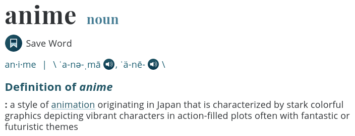

**Goal**: Create an recommendation engine to predict which titles an individual who has watched a few anime shows, is likely to enjoy the most. 

## 1. Data Collection & Cleaning <a name="1-collection" href="#toc">^</a>

The data for this project was collected by scraping pages from [Anime-Planet](https://www.anime-planet.com/), a database that contains information about anime shows/movies and a place for users to log their watch history, to-watch list, rate and review anime. 

To find links to user pages, the program crawled over 5 million pages of the websites. It then scraped 250k+ pages of user data, did some preliminary cleaning, and stored the data in a SQL database.

For exploratory analysis of the data, take a look at the [appendix](#appendix).

## 2. Feature Engineering <a name="2-fe"  href="#toc">^</a>

The titles in the data set are rated on a scale of 0 to 5, with 0.5 increments. Since different users have a varied rating scale (some users may be more likely to maintain a higher average rating, and vice-versa), the ratings need to be normalised to account for the individual user's behaviour. To accomplish this, a mean/std scaler was used to bring the mean rating of each users to 0 and their standard deviation to 1 (just like a standard normal distribution).

However, this created the problem that some ratings were extremely far from 0 (either negative or positive directions). To address this, a logistic/sigmoid function was used to compress all the results into the range of 0 to 1. 

The function that was used is:

$$
f(x) = \frac{1}{1 + e^{-x}}
$$

Afterwards, a pivot was applied to the data set to get usernames as the row indicies, show titles as the column names, and each cell represents the rating that particular user gave to the specific title (empty cells where users have not rated those titles).

## 3. Model Training & Evaluation Method <a name="3-model"  href="#toc">^</a>

The model used in this project was written from scratch. The main part of it is the construction of the cosine similarity matrix to find out which users are most similar to each other. This information is then used to find the average rating for each title of all the most similar users. Then, the  highest predicted values (titles the current user is most likely to enjoy based on the rating of similar users) is output to the user to allow them to pick the title they think would be the most interesting.

The decided upon evaluation metric is RMSE (Root Mean Squared Error). A RMSE value of 0 represents a perfect prediction, while a large value represents poor prediction performance. 

A few hyper-parameters were tuned to improve the performance of the model. These include the number of similar users to consider for the prediction of ratings, and also, whether to apply a simple or weighted average for the predicted rating of each titles. The first parameter is fairly self-explanatory, the weighted averaging method will be explained. When the number of similar users are decided, the next step is to give a higher weighting to the most similar user, a little less weighting to the second most similar user, and so on until the last of the similar users has the lowest weight. Doing this ensures that the magnitude of similarity is also considered in the average, since the more similar a user is, their rating patters are probably more indicative of the current user's, when compared to another user that is less similar.

## 4. Final Results <a name="4-results" href="#toc">^</a>

After testing many models with varied hyper-parameters, the best model was determined to the model that considers the weighted average of the 2000 most similar users, with an RMSE of 0.179026.

Comparing this to the benchmark (the overall average rating of each title), which had an RMSE of 0.184883, the model seems to perform better. While the improvement is not largely significant, the models seems to have an ~3.1681% decrease in RMSE compared to the benchmark.

## Conclusion <a name="conclusion" href="#toc">^</a>

While the model only performs slightly better than the benchmark (overall average rating of each title), this has been an incredible learning opportunity as I was able to stretch the limits of my understanding, and learn or improve on many skills such as web scraping, multi-processing, database creation and management, SQL queries, parallel-processing, data cleaning, exploratory analysis, model creation and evaluation, etc.

I look forward to working on many more exciting projects in the future!


## Appendix: Exploratory Analysis <a name="appendix" href="#toc">^</a>

First, let's check the shape of the data:

```python
df.shape

# (9205634, 18)
```

We see that the main data set contains **n = 9,205,634** observations and **19** variables.

Also, the shape of the anime data set:

```python
anime.shape

# (4473, 14)
```

The anime data set contains **n = 4,473** observations and **14** variables.

Next, let's take a look at some high-level info about the data:

```python
df.info(show_counts=True)

# <class 'pandas.core.frame.DataFrame'>
# RangeIndex: 9205634 entries, 0 to 9205633
# Data columns (total 18 columns):
#  #   Column            Non-Null Count    Dtype   
# ---  ------            --------------    -----   
#  0   title             9205634 non-null  category
#  1   url               9205634 non-null  category
#  2   username          9205634 non-null  category
#  3   status            9205634 non-null  category
#  4   times_watched     9205634 non-null  uint16  
#  5   user_rating       9205634 non-null  float32 
#  6   num_eps           9205634 non-null  uint16  
#  7   ongoing           9205634 non-null  bool    
#  8   duration          334574 non-null   float32 
#  9   studio            9194196 non-null  category
#  10  start_year        9205634 non-null  float64 
#  11  end_year          9205634 non-null  float64 
#  12  season            8960955 non-null  category
#  13  avg_rating        9205634 non-null  float32 
#  14  num_votes         9205634 non-null  uint32  
#  15  synopsis          9205634 non-null  string  
#  16  tags              9205397 non-null  object  
#  17  content_warnings  3604265 non-null  object  
# dtypes: bool(1), category(6), float32(3), float64(2), object(2), string(1), uint16(2), uint32(1)
# memory usage: 646.1+ MB
```

Just the anime data set now:

```python
anime.info(show_counts=True)

# <class 'pandas.core.frame.DataFrame'>
# RangeIndex: 4473 entries, 0 to 4472
# Data columns (total 14 columns):
#  #   Column            Non-Null Count  Dtype   
# ---  ------            --------------  -----   
#  0   title             4473 non-null   category
#  1   num_eps           4473 non-null   uint16  
#  2   ongoing           4473 non-null   bool    
#  3   duration          855 non-null    float32 
#  4   studio            4159 non-null   category
#  5   start_year        4473 non-null   float64 
#  6   end_year          4473 non-null   float64 
#  7   season            3505 non-null   category
#  8   avg_rating        4473 non-null   float32 
#  9   num_votes         4473 non-null   uint32  
#  10  synopsis          4473 non-null   string  
#  11  tags              4462 non-null   object  
#  12  content_warnings  702 non-null    object  
#  13  url               4473 non-null   category
# dtypes: bool(1), category(4), float32(2), float64(2), object(2), string(1), uint16(1), uint32(1)
# memory usage: 620.3+ KB
```

Now, let's examine each of these variables individually:

### i. Title (`title`) <a href="#2-ea">^</a>

Let's find how many unique anime shows are present in this data set:

```python
anime['title'].nunique()

# 4473
```

Of these, which are the most popular?

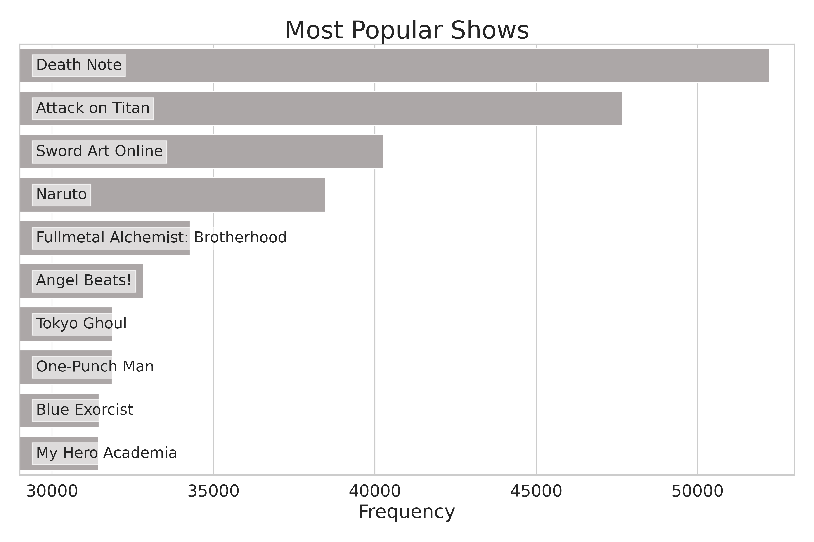

### ii. Number of Episodes (`num_eps`) <a href="#2-ea">^</a>

Let's examine the `num_eps` columns:

```python
anime['num_eps'].describe()

# count    4473.000000
# mean       35.872569
# std       103.016344
# min         1.000000
# 25%        12.000000
# 50%        20.000000
# 75%        35.000000
# max      2617.000000
# Name: num_eps, dtype: float64
```

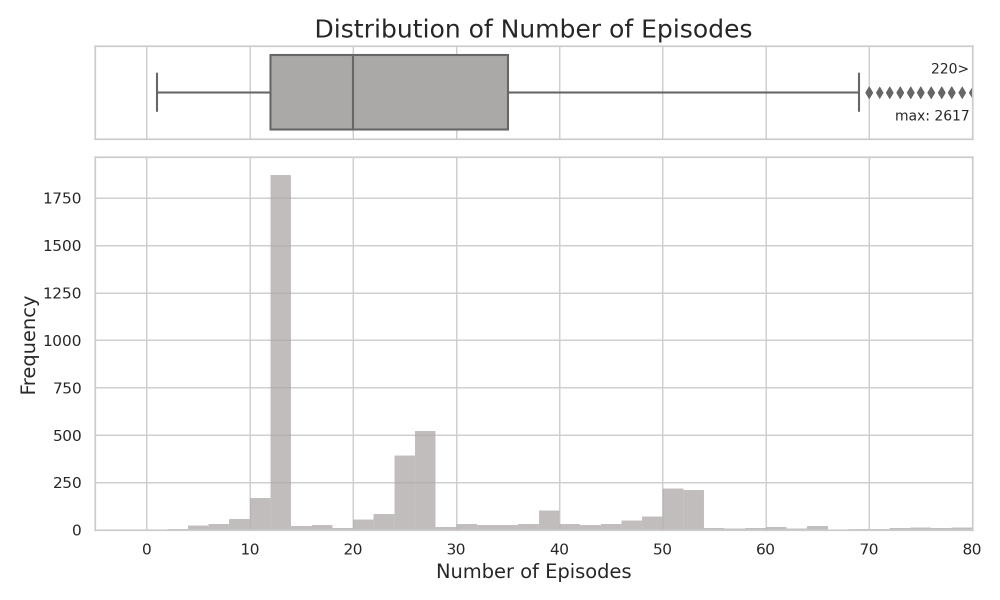

We see that the maximum number of episodes a show has is: **2,617**. 

That's quite a lot of episodes. Let's find out which title it is.

```python
anime.loc[anime['num_eps'] == anime['num_eps'].max(), \
          ['title', 'num_eps', 'ongoing', 'start_year', 'end_year', 'duration']]
```

<table border="1" class="dataframe">
  <thead>
    <tr style="text-align: right;">
      <th></th>
      <th>title</th>
      <th>num_eps</th>
      <th>is_ongoing</th>
      <th>start_year</th>
      <th>end_year</th>
      <th>duration</th>
    </tr>
  </thead>
  <tbody>
    <tr>
      <th>3513</th>
      <td>Sazae-san</td>
      <td>2617</td>
      <td>True</td>
      <td>1969.0000</td>
      <td>NaN</td>
      <td>NaN</td>
    </tr>
  </tbody>
</table>


It's a show called _Sazae-san_, which started in **1969** and is still ongoing!

### iii. Is the show ongoing? (`is_ongoing`) <a href="#2-ea">^</a>

```python
anime['ongoing'].value_counts(dropna=False)

# False    4397
# True       76
# Name: is_ongoing, dtype: int64
```

We see that the vast majority of shows are not ongoing (meaning they are completed).

### iv. Duration (`duration`) <a href="#2-ea">^</a>

```python
anime['duration'].describe()

# count   855.0000
# mean      7.2468
# std       7.3307
# min       1.0000
# 25%       3.0000
# 50%       5.0000
# 75%      10.0000
# max      90.0000
# Name: duration, dtype: float64
```

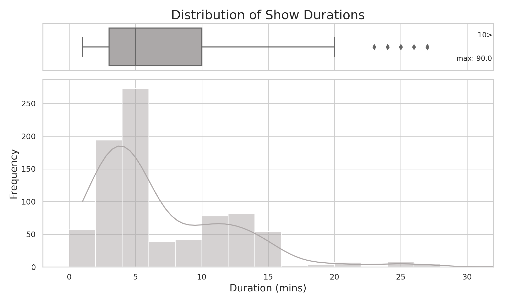

We see that the maximum duration (length of an episode in minutes) a show has is: **90**. 

Let's find out which title it is.

```python
anime.loc[anime['duration'] == anime['duration'].max(), \
          ['title', 'duration', 'num_eps', 'is_ongoing', 'start_year', 'end_year']]
```

<table border="1" class="dataframe">
  <thead>
    <tr style="text-align: right;">
      <th></th>
      <th>title</th>
      <th>num_eps</th>
      <th>is_ongoing</th>
      <th>start_year</th>
      <th>end_year</th>
      <th>duration</th>
    </tr>
  </thead>
  <tbody>
    <tr>
      <th>3704</th>
      <td>Heidi: Heidi to Clara Hen</td>
      <td>1</td>
      <td>False</td>
      <td>1996</td>
      <td>1996</td>
      <td>90</td>
    </tr>
  </tbody>
</table>


It's a show called _Heidi: Heidi to Clara Hen_.

### v. Studio (`studio`) <a href="#2-ea">^</a>

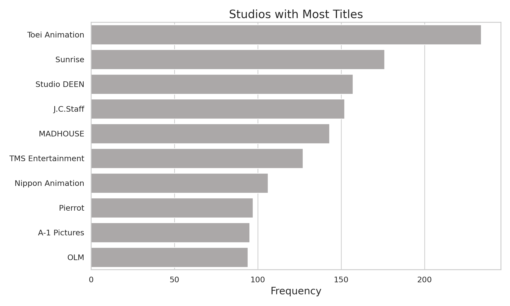

We see that _Toei Animation_ studio has created the most unique anime shows.

### vi. Start Year (`start_year`) <a href="#2-ea">^</a>

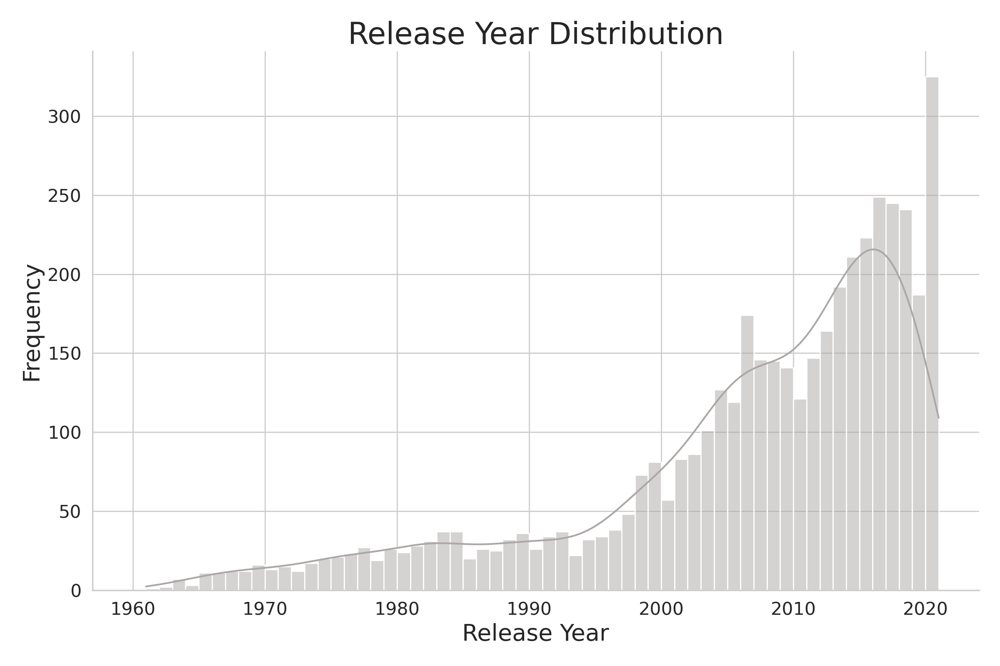

We can see a sharp rise in the release of anime shows since the mid 1990's and we see a sudden dip in 2020, most likely due to the global pandemic.

### vii. Season (`season`) <a href="#2-ea">^</a>

Anime release times are divided into four season throughout the year: *Winter*, *Spring*, *Summer*, and *Fall*.

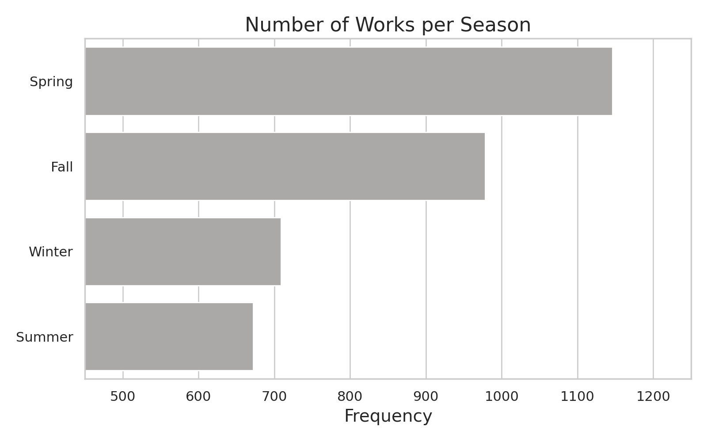

We see that the most number of titles are released in the *Spring*. On the other hand, *Summer* seems to be the least popular release time.

### viii. User Rating (`user_rating`) <a href="#2-ea">^</a>

The user ratings are on a scale from **0.5** to **5.0** with incremental steps of **0.5**.

```python
df['user_rating'].describe()

# count   9205634.0000
# mean          3.8376
# std           0.9931
# min           0.5000
# 25%           3.5000
# 50%           4.0000
# 75%           4.5000
# max           5.0000
# Name: user_rating, dtype: float64
```


### ix. Average Rating (`avg_rating`) <a href="#2-ea">^</a>

The average rating is the simple average of all the user ratings for this show.

The ratings are on a scale from **0.5** to **5.0** with incremental steps of **0.5**.

```python
anime['avg_rating'].describe()

# count   4473.0000
# mean       3.4655
# std        0.4036
# min        1.3330
# 25%        3.2390
# 50%        3.4490
# 75%        3.7150
# max        4.6330
# Name: avg_rating, dtype: float64
```

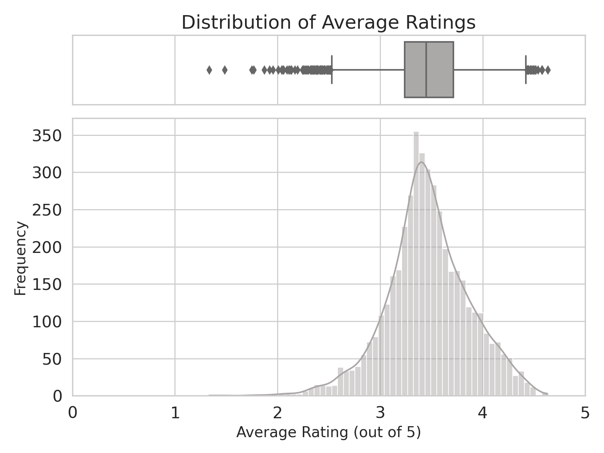

By inspection, the average ratings seem to be about normally distributed.

Now, let's find which shows have the highest ratings:

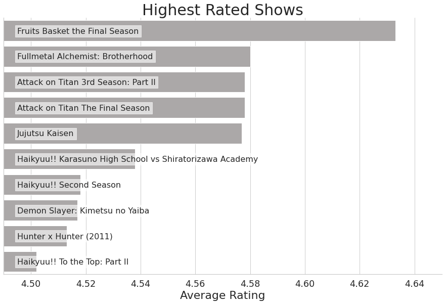

Currently, the top rated show seems to be: *Fruits Basket the Final Season*.

### x. Number of Votes (`num_votes`) <a href="#2-ea">^</a>

```python
anime['num_votes'].describe()

# count     4473.0000
# mean      4694.4965
# std      10369.1517
# min         10.0000
# 25%         94.0000
# 50%        941.0000
# 75%       4493.0000
# max     157688.0000
# Name: num_votes, dtype: float64
```

Let's find out which shows have the most votes:

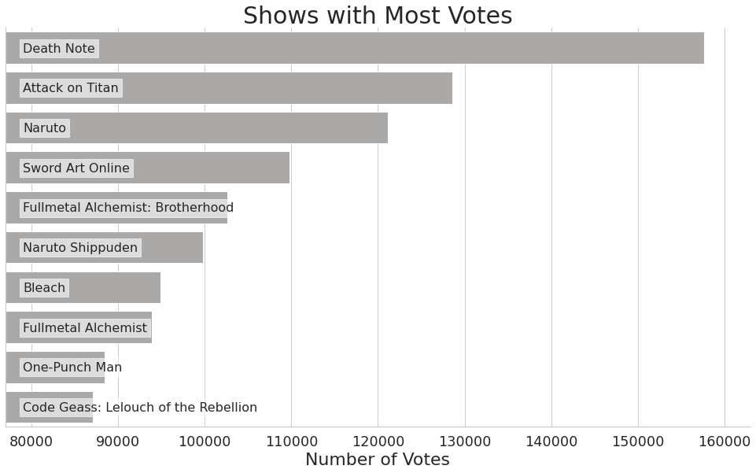

### xi. Tags (`tags`) <a href="#2-ea">^</a>

How many unique tags are there?

```python
tags_df = anime[['title', 'tags']].set_index('title')
tags_df = tags_df.explode('tags').reset_index()
tags_df['tags'].nunique()

# 493
```

Which tags are the most common?

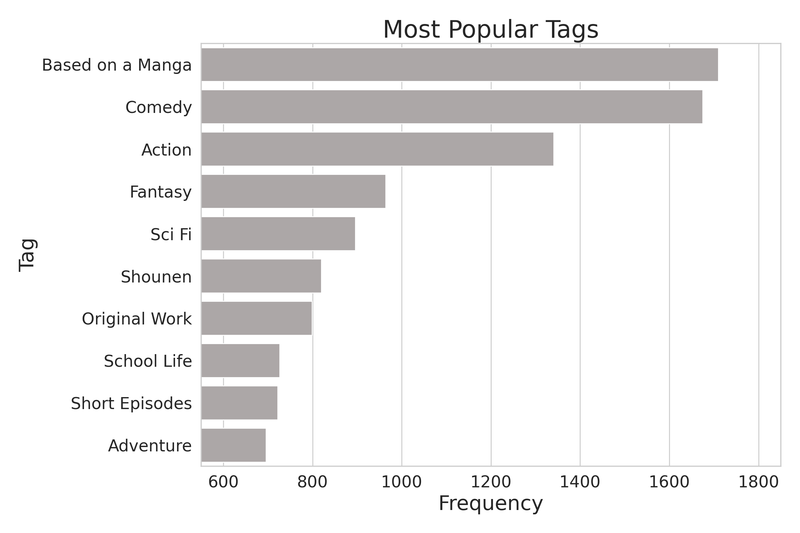

### xii. Content Warnings (`content_warnings`) <a href="#2-ea">^</a>

Let's see how many unique content warning labels there are:

```python
cw_df = anime[['title', 'content_warnings']].set_index('title')
cw_df = cw_df.explode('content_warnings').reset_index()
cw_df['content_warnings'].nunique()

# 18
```

Now, let's arrange them from most to least common:

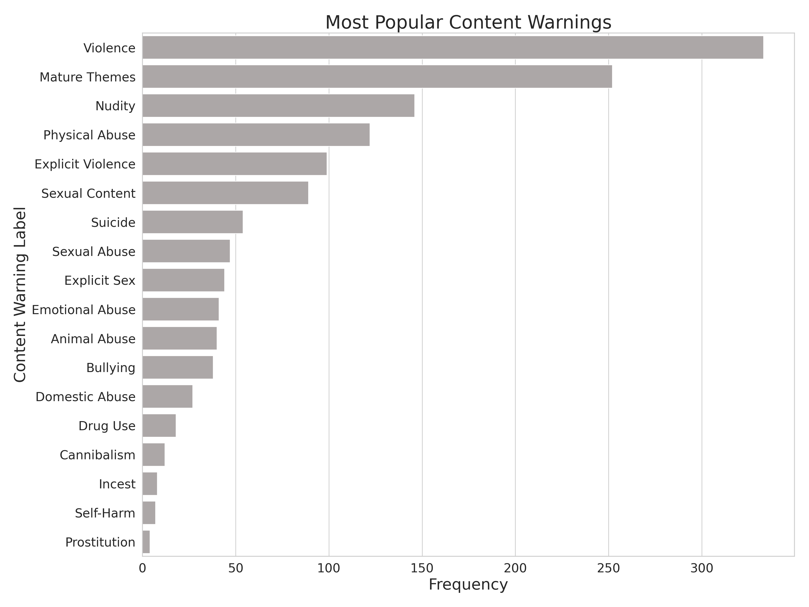

### xiii. Users (`username`) <a href="#2-ea">^</a>

How many unique users are in this data set?

```python
df['username'].nunique()

# 117162
```

There seems to **117,162** unique users.

Let's find which users are the most active by checking how many titles they have watched:

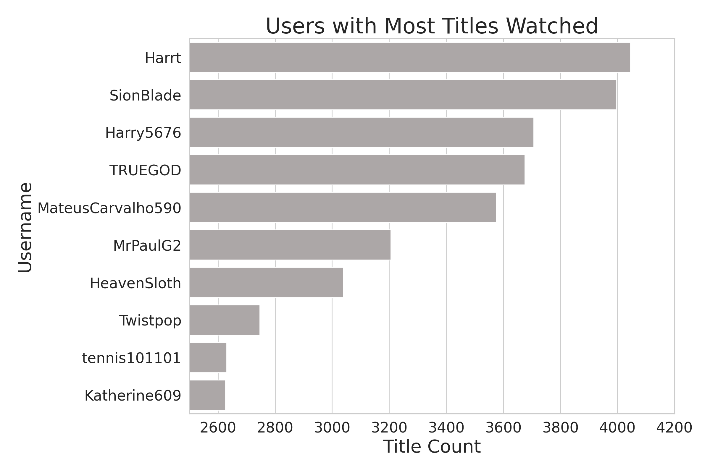

### xiv. Watch Status (`status`) <a href="#2-ea">^</a>

```python
df['status'].value_counts()

# Watched     8212660
# Dropped      386434
# Watching     354600
# Stalled      251940
# Name: status, dtype: int64
```

The overwhelming majority of entries in this data set have been watched.

### xv. Number of Times Watched (`times_watched`) <a href="#2-ea">^</a>

```python
df['times_watched'].describe()

# count   9205634.0000
# mean          1.2303
# std           4.2770
# min           0.0000
# 25%           1.0000
# 50%           1.0000
# 75%           1.0000
# max         181.0000
# Name: times_watched, dtype: float64
```

Let's find the most common number of times users watch a show:

```python
df['times_watched'].value_counts().head(10)

# 1     7554419
# 0      992974
# 2      384097
# 3      132263
# 4       45967
# 5       26783
# 99      14204
# 6       11292
# 10       7227
# 7        6137
# Name: times_watched, dtype: int64
```

The vast majority only watch shows once, however, many others like to re-watch shows multiple times. 

## Sources <a name="sources" href="#toc">^</a>

[Anime-Planet](https://www.anime-planet.com/)

[Definition of Anime](https://www.merriam-webster.com/dictionary/anime)

[Similar Project](https://medium.com/code-heroku/building-a-movie-recommendation-engine-in-python-using-scikit-learn-c7489d7cb145)
