# The Anime Recommendation Engine

### Helping you find your next favourite anime to binge watch


## Table of Contents <a name="toc"></a>

_**[Introduction](#introduction)**_

_**[1. Data Collection & Cleaning](#1-collection)**_

_**[2. Exploratory Analysis](#2-ea)**_

_**[3. Relational (Multivariate) Analysis ](#3-ra)**_

_**[4. Feature Engineering & Data Preparation](#4-fe+dp)**_ 

_**[5. Model Training & Evaluation](#5-model)**_

_**[6. Final Results](#6-results)**_

_**[Conclusion](#conclusion)**_

_**[Appendix](#appendix)**_

&nbsp;&nbsp;&nbsp;&nbsp;&nbsp;&nbsp;&nbsp;&nbsp;_**[Appendix 1: Featured Tables](#appendix1)**_

&nbsp;&nbsp;&nbsp;&nbsp;&nbsp;&nbsp;&nbsp;&nbsp;_**[Appendix 2: Model Evaluation](#appendix2)**_

&nbsp;&nbsp;&nbsp;&nbsp;&nbsp;&nbsp;&nbsp;&nbsp;_**[Appendix 3: Reproducing the Results](#appendix3)**_

_**[Sources](#sources)**_

## Introduction <a name="introduction" href="#toc">^</a>


## 1. Data Collection & Cleaning <a name="1-collection" href="#toc">^</a>

The data for this project was collected by scraping pages from [Anime-Planet](https://www.anime-planet.com/), a database that contains information about anime shows/movies and a place for users to log their watch history, to-watch list, rate and review anime. 


## 2. Exploratory Analysis <a name="2-ea"  href="#toc">^</a>

First, let's check the shape of the data:

```python
df.shape

# (9205634, 18)
```

We see that the main data set contains **n = 9,205,634** observations and **19** variables.

Also, the shape of the anime data set:

```python
anime.shape

# (4473, 14)
```

The anime data set contains **n = 4,473** observations and **14** variables.

Next, let's take a look at some high-level info about the data:

```python
df.info(show_counts=True)

# <class 'pandas.core.frame.DataFrame'>
# RangeIndex: 9205634 entries, 0 to 9205633
# Data columns (total 18 columns):
#  #   Column            Non-Null Count    Dtype   
# ---  ------            --------------    -----   
#  0   title             9205634 non-null  category
#  1   url               9205634 non-null  category
#  2   username          9205634 non-null  category
#  3   status            9205634 non-null  category
#  4   times_watched     9205634 non-null  uint16  
#  5   user_rating       9205634 non-null  float32 
#  6   num_eps           9205634 non-null  uint16  
#  7   ongoing           9205634 non-null  bool    
#  8   duration          334574 non-null   float32 
#  9   studio            9194196 non-null  category
#  10  start_year        9205634 non-null  float64 
#  11  end_year          9205634 non-null  float64 
#  12  season            8960955 non-null  category
#  13  avg_rating        9205634 non-null  float32 
#  14  num_votes         9205634 non-null  uint32  
#  15  synopsis          9205634 non-null  string  
#  16  tags              9205397 non-null  object  
#  17  content_warnings  3604265 non-null  object  
# dtypes: bool(1), category(6), float32(3), float64(2), object(2), string(1), uint16(2), uint32(1)
# memory usage: 646.1+ MB
```

Just the anime data set now:

```python
anime.info(show_counts=True)

# <class 'pandas.core.frame.DataFrame'>
# RangeIndex: 4473 entries, 0 to 4472
# Data columns (total 14 columns):
#  #   Column            Non-Null Count  Dtype   
# ---  ------            --------------  -----   
#  0   title             4473 non-null   category
#  1   num_eps           4473 non-null   uint16  
#  2   ongoing           4473 non-null   bool    
#  3   duration          855 non-null    float32 
#  4   studio            4159 non-null   category
#  5   start_year        4473 non-null   float64 
#  6   end_year          4473 non-null   float64 
#  7   season            3505 non-null   category
#  8   avg_rating        4473 non-null   float32 
#  9   num_votes         4473 non-null   uint32  
#  10  synopsis          4473 non-null   string  
#  11  tags              4462 non-null   object  
#  12  content_warnings  702 non-null    object  
#  13  url               4473 non-null   category
# dtypes: bool(1), category(4), float32(2), float64(2), object(2), string(1), uint16(1), uint32(1)
# memory usage: 620.3+ KB
```

Now, let's examine each of these variables individually:

### 2.1. Title (`title`) <a href="#2-ea">^</a>

Let's find how many unique anime shows are present in this data set:

```python
anime['title'].nunique()

# 4473
```

Of these, which are the most popular?

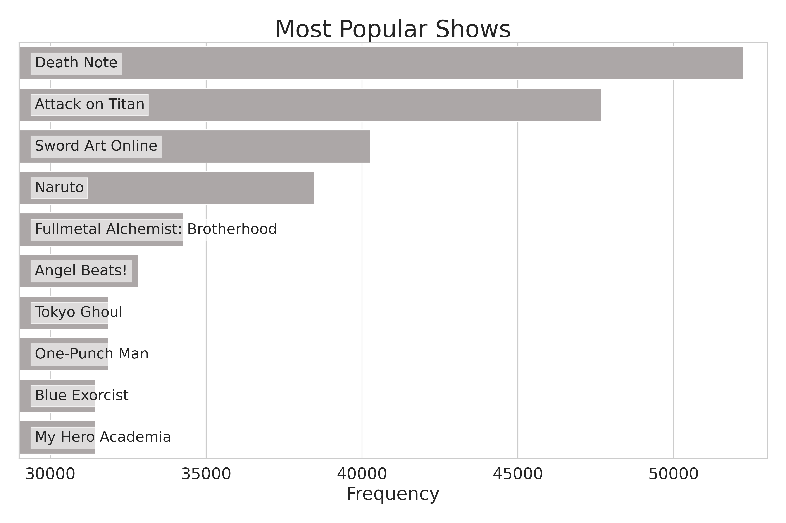

### 2.2. Number of Episodes (`num_eps`) <a href="#2-ea">^</a>

Let's examine the `num_eps` columns:

```python
anime['num_eps'].describe()

# count    4473.000000
# mean       35.872569
# std       103.016344
# min         1.000000
# 25%        12.000000
# 50%        20.000000
# 75%        35.000000
# max      2617.000000
# Name: num_eps, dtype: float64
```

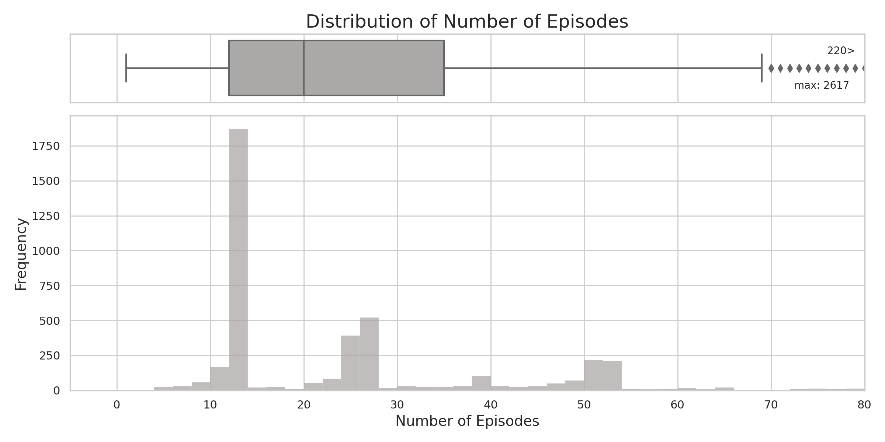

We see that the maximum number of episodes a show has is: **2,617**. 

That's quite a lot of episodes. Let's find out which title it is.

```python
anime.loc[anime['num_eps'] == anime['num_eps'].max(), \
          ['title', 'num_eps', 'ongoing', 'start_year', 'end_year', 'duration']]
```

<table border="1" class="dataframe">
  <thead>
    <tr style="text-align: right;">
      <th></th>
      <th>title</th>
      <th>num_eps</th>
      <th>is_ongoing</th>
      <th>start_year</th>
      <th>end_year</th>
      <th>duration</th>
    </tr>
  </thead>
  <tbody>
    <tr>
      <th>3513</th>
      <td>Sazae-san</td>
      <td>2617</td>
      <td>True</td>
      <td>1969.0000</td>
      <td>NaN</td>
      <td>NaN</td>
    </tr>
  </tbody>
</table>

It's a show called _Sazae-san_, which started in **1969** and is still ongoing!

### 2.3. Is the show ongoing? (`is_ongoing`) <a href="#2-ea">^</a>

```python
anime['ongoing'].value_counts(dropna=False)

# False    4397
# True       76
# Name: is_ongoing, dtype: int64
```

We see that the vast majority of shows are not ongoing (meaning they are completed).

### 2.4. Duration (`duration`) <a href="#2-ea">^</a>

```python
anime['duration'].describe()

# count   855.0000
# mean      7.2468
# std       7.3307
# min       1.0000
# 25%       3.0000
# 50%       5.0000
# 75%      10.0000
# max      90.0000
# Name: duration, dtype: float64
```

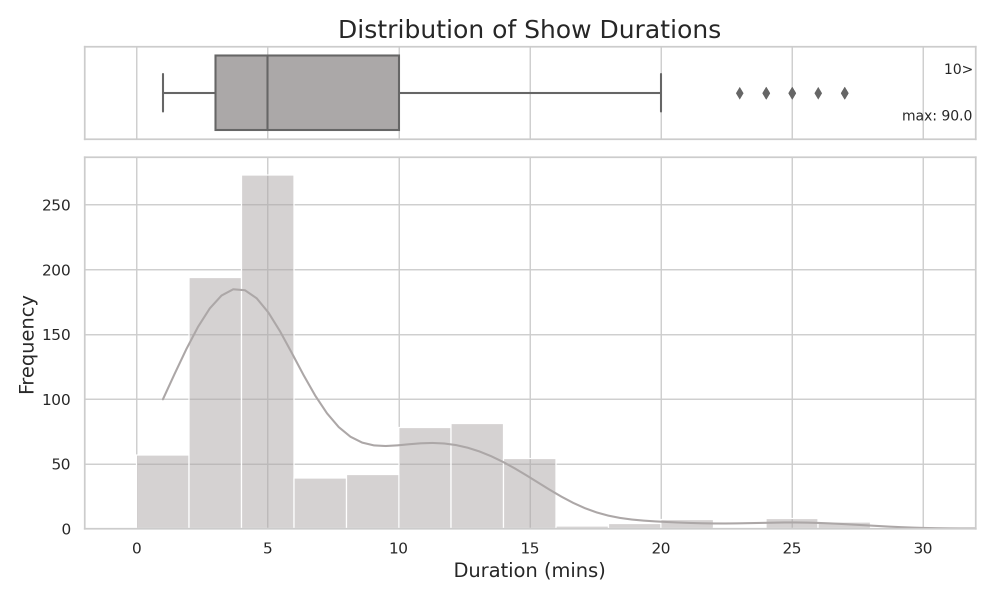

We see that the maximum duration (length of an episode in minutes) a show has is: **90**. 

Let's find out which title it is.

```python
anime.loc[anime['duration'] == anime['duration'].max(), \
          ['title', 'duration', 'num_eps', 'is_ongoing', 'start_year', 'end_year']]
```

<table border="1" class="dataframe">
  <thead>
    <tr style="text-align: right;">
      <th></th>
      <th>title</th>
      <th>num_eps</th>
      <th>is_ongoing</th>
      <th>start_year</th>
      <th>end_year</th>
      <th>duration</th>
    </tr>
  </thead>
  <tbody>
    <tr>
      <th>3704</th>
      <td>Heidi: Heidi to Clara Hen</td>
      <td>1</td>
      <td>False</td>
      <td>1996</td>
      <td>1996</td>
      <td>90</td>
    </tr>
  </tbody>
</table>

It's a show called _Heidi: Heidi to Clara Hen_.

### 2.5. Studio (`studio`) <a href="#2-ea">^</a>

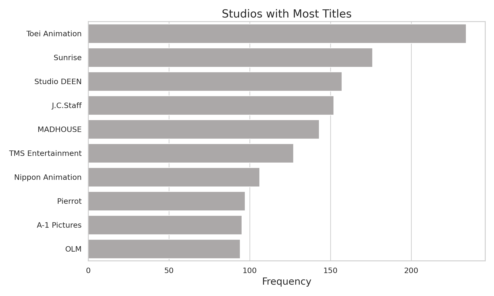

We see that _Toei Animation_ studio has created the most unique anime shows.

### 2.6. Start Year (`start_year`) <a href="#2-ea">^</a>

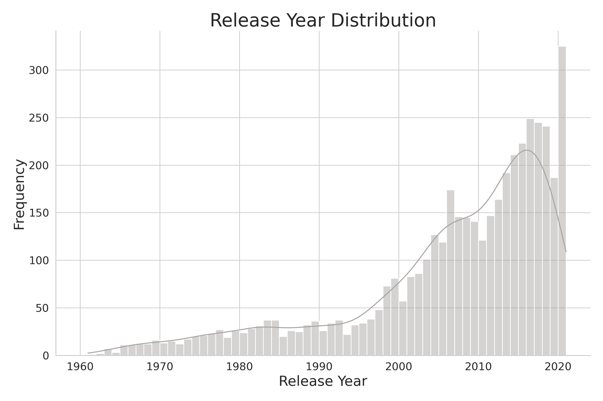

We can see a sharp rise in the release of anime shows since the mid 1990's and we see a sudden dip in 2020, most likely due to the global pandemic.

### 2.7. Season (`season`) <a href="#2-ea">^</a>

Anime release times are divided into four season throughout the year: *Winter*, *Spring*, *Summer*, and *Fall*.

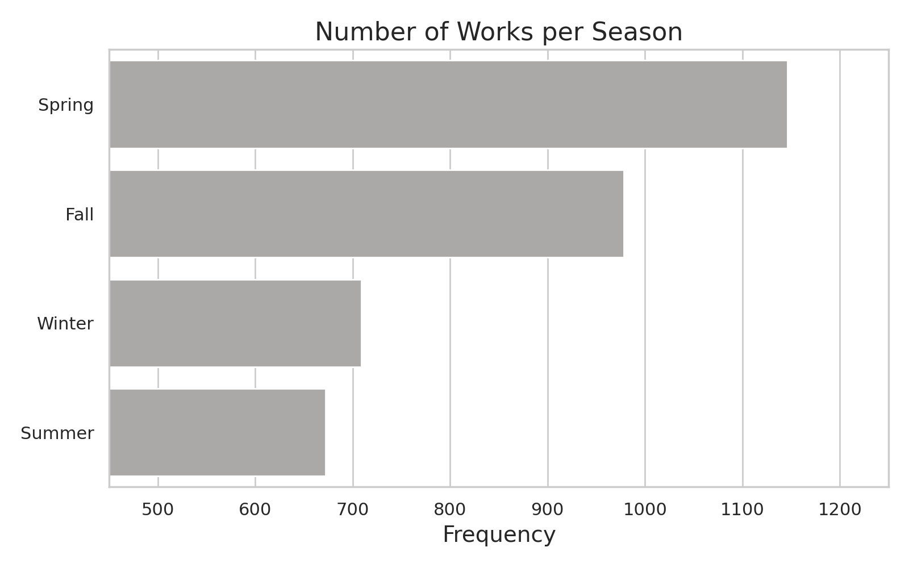

We see that the most number of titles are released in the *Spring*. On the other hand, *Summer* seems to be the least popular release time.

### 2.8. User Rating (`user_rating`) <a href="#2-ea">^</a>

The user ratings are on a scale from **0.5** to **5.0** with incremental steps of **0.5**.

```python
df['user_rating'].describe()

# count   9205634.0000
# mean          3.8376
# std           0.9931
# min           0.5000
# 25%           3.5000
# 50%           4.0000
# 75%           4.5000
# max           5.0000
# Name: user_rating, dtype: float64
```

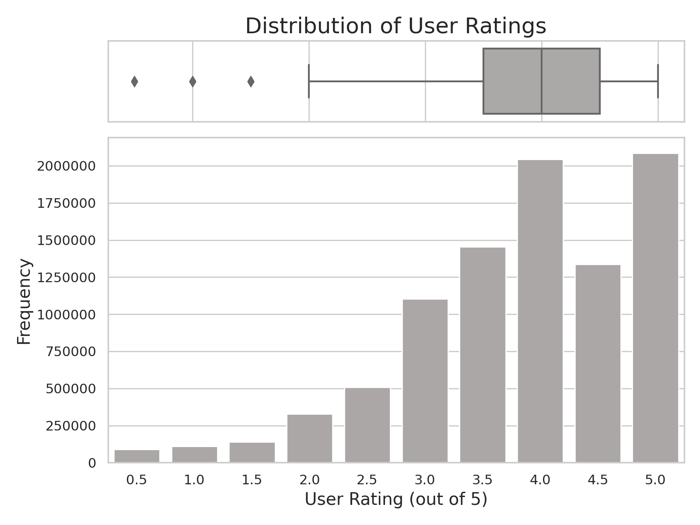

### 2.9. Average Rating (`avg_rating`) <a href="#2-ea">^</a>

The average rating is the simple average of all the user ratings for this show.

The ratings are on a scale from **0.5** to **5.0** with incremental steps of **0.5**.

```python
anime['avg_rating'].describe()

# count   4473.0000
# mean       3.4655
# std        0.4036
# min        1.3330
# 25%        3.2390
# 50%        3.4490
# 75%        3.7150
# max        4.6330
# Name: avg_rating, dtype: float64
```

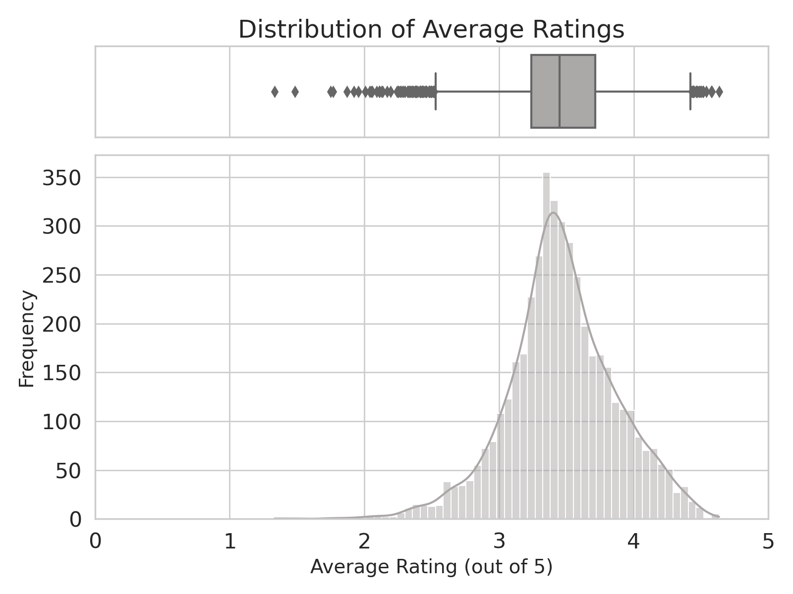

By inspection, the average ratings seem to be about normally distributed.

Now, let's find which shows have the highest ratings:

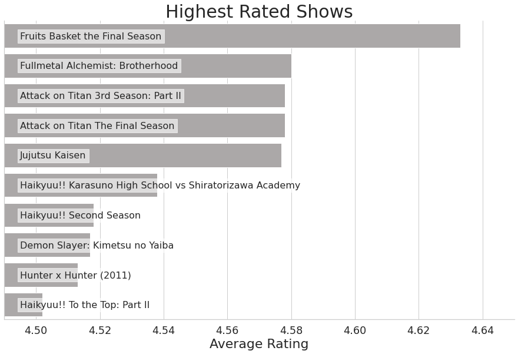

Currently, the top rated show seems to be: *Fruits Basket the Final Season*.

### 2.10. Number of Votes (`num_votes`) <a href="#2-ea">^</a>

```python
anime['num_votes'].describe()

# count     4473.0000
# mean      4694.4965
# std      10369.1517
# min         10.0000
# 25%         94.0000
# 50%        941.0000
# 75%       4493.0000
# max     157688.0000
# Name: num_votes, dtype: float64
```

Let's find out which shows have the most votes:

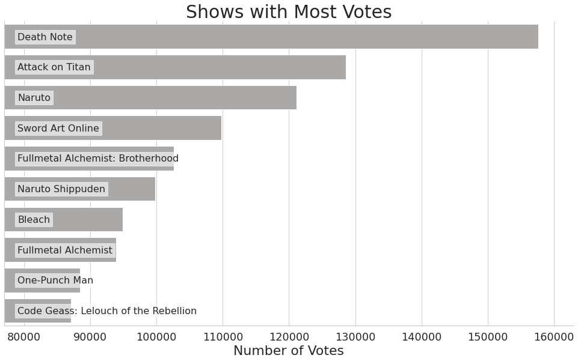

### 2.11. Tags (`tags`) <a href="#2-ea">^</a>

How many unique tags are there?

```python
tags_df = anime[['title', 'tags']].set_index('title')
tags_df = tags_df.explode('tags').reset_index()
tags_df['tags'].nunique()

# 493
```

Which tags are the most common?

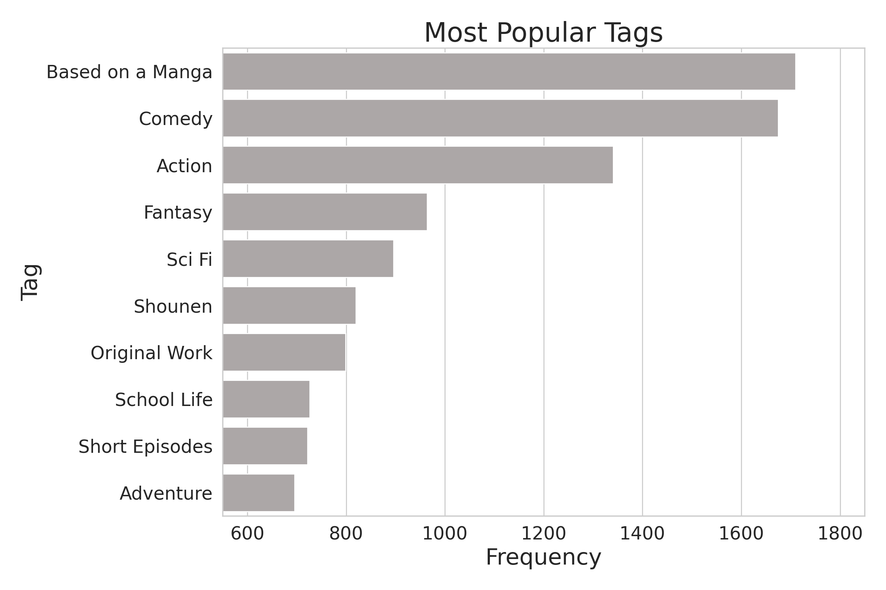

### 2.12. Content Warnings (`content_warnings`) <a href="#2-ea">^</a>

Let's see how many unique content warning labels there are:

```python
cw_df = anime[['title', 'content_warnings']].set_index('title')
cw_df = cw_df.explode('content_warnings').reset_index()
cw_df['content_warnings'].nunique()

# 18
```

Now, let's arrange them from most to least common:

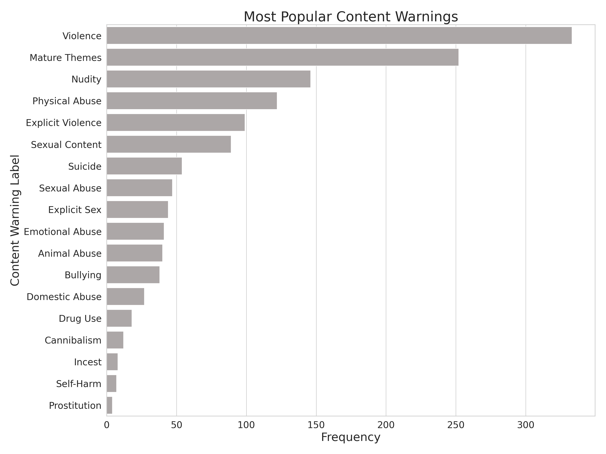

### 2.13. Users (`username`) <a href="#2-ea">^</a>

How many unique users are in this data set?

```python
df['username'].nunique()

# 117162
```

There seems to **117,162** unique users.

Let's find which users are the most active by checking how many titles they have watched:

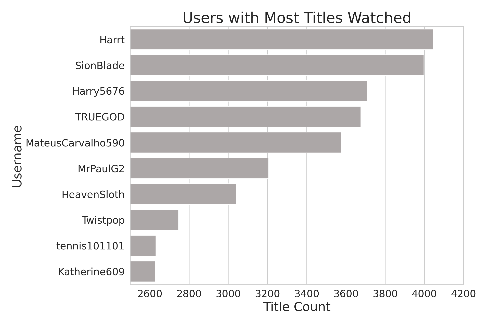

### 2.14. Watch Status (`status`) <a href="#2-ea">^</a>

```python
df['status'].value_counts()

# Watched     8212660
# Dropped      386434
# Watching     354600
# Stalled      251940
# Name: status, dtype: int64
```

The overwhelming majority of entries in this data set have been watched.

### 2.15. Number of Times Watched (`times_watched`) <a href="#2-ea">^</a>

```python
df['times_watched'].describe()

# count   9205634.0000
# mean          1.2303
# std           4.2770
# min           0.0000
# 25%           1.0000
# 50%           1.0000
# 75%           1.0000
# max         181.0000
# Name: times_watched, dtype: float64
```

Let's find the most common number of times users watch a show:

```python
df['times_watched'].value_counts().head(10)

# 1     7554419
# 0      992974
# 2      384097
# 3      132263
# 4       45967
# 5       26783
# 99      14204
# 6       11292
# 10       7227
# 7        6137
# Name: times_watched, dtype: int64
```

The vast majority only watch shows once, however, many others like to re-watch shows multiple times. 

## 3. Relational (Multivariate) Analysis <a name="3-ra"  href="#toc">^</a>

## 4. Feature Engineering & Data Preparation <a name="4-fe+dp"  href="#toc">^</a>

## 5. Model Training & Evaluation <a name="5-model"  href="#toc">^</a>

## 6. Final Results <a name="6-results" href="#toc">^</a>

## Conclusion <a name="conclusion" href="#toc">^</a>

## Appendix <a name="appendix" href="#toc">^</a>

### Appendix 1: Featured Tables <a name="appendix1" href="#toc">^</a>

#### Table 1: 

| Feature Name | Description | Data Type |
| :----------: | :---------: | :-------: |
|              |             |           |
|              |             |           |
|              |             |           |
|              |             |           |

### Appendix 2: In-depth Model Evaluation <a name="appendix3" href="#toc">^</a>

### Appendix 3: Reproducing the Results <a name="appendix4" href="#toc">^</a>

## Sources <a name="sources" href="#toc">^</a>

