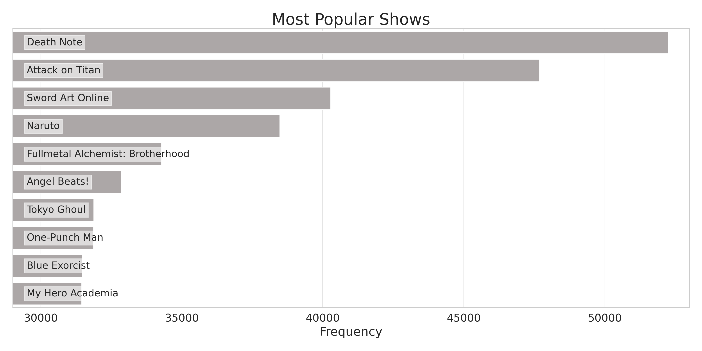

# The Anime Recommendation Engine

### Helping you find your next favourite anime to binge watch


## Table of Contents <a name="toc"></a>

_**[Introduction](#introduction)**_

_**[1. Data Collection & Cleaning](#1-collection)**_

_**[2. Exploratory Analysis](#2-ea)**_

_**[3. Relational (Multivariate) Analysis ](#3-ra)**_

_**[4. Feature Engineering & Data Preparation](#4-fe+dp)**_ 

_**[5. Model Training & Evaluation](#5-model)**_

_**[6. Final Results](#6-results)**_

_**[Conclusion](#conclusion)**_

_**[Appendix](#appendix)**_

&nbsp;&nbsp;&nbsp;&nbsp;&nbsp;&nbsp;&nbsp;&nbsp;_**[Appendix 1: Featured Tables](#appendix1)**_

&nbsp;&nbsp;&nbsp;&nbsp;&nbsp;&nbsp;&nbsp;&nbsp;_**[Appendix 2: Model Evaluation](#appendix2)**_

&nbsp;&nbsp;&nbsp;&nbsp;&nbsp;&nbsp;&nbsp;&nbsp;_**[Appendix 3: Reproducing the Results](#appendix3)**_

_**[Sources](#sources)**_

## Introduction <a name="introduction" href="#toc">^</a>


## 1. Data Collection & Cleaning <a name="1-collection" href="#toc">^</a>

The data for this project was collected by scraping pages from [Anime-Planet](https://www.anime-planet.com/), a database that contains information about anime shows/movies and a place for users to log their watch history, to-watch list, rate and review anime. 


## 2. Exploratory Analysis <a name="2-ea"  href="#toc">^</a>

Let's take a look at some high-level info about the data:

```python
df.info(show_counts=True)
```

```
# <class 'pandas.core.frame.DataFrame'>
# RangeIndex: 9205634 entries, 0 to 9205633
# Data columns (total 18 columns):
#  #   Column            Non-Null Count    Dtype   
# ---  ------            --------------    -----   
#  0   title             9205634 non-null  category
#  1   url               9205634 non-null  category
#  2   username          9205634 non-null  category
#  3   status            9205634 non-null  category
#  4   times_watched     9205634 non-null  uint16  
#  5   user_rating       9205634 non-null  float32 
#  6   num_eps           9205634 non-null  uint16  
#  7   ongoing           9205634 non-null  bool    
#  8   duration          334574 non-null   float32 
#  9   studio            9194196 non-null  category
#  10  start_year        9205634 non-null  float64 
#  11  end_year          9205634 non-null  float64 
#  12  season            8960955 non-null  category
#  13  avg_rating        9205634 non-null  float32 
#  14  num_votes         9205634 non-null  uint32  
#  15  synopsis          9205634 non-null  string  
#  16  tags              9205397 non-null  object  
#  17  content_warnings  3604265 non-null  object  
# dtypes: bool(1), category(6), float32(3), float64(2), object(2), string(1), uint16(2), uint32(1)
# memory usage: 646.1+ MB
```

Just the anime data set now:

```python
anime.info(show_counts=True)
```

```
# <class 'pandas.core.frame.DataFrame'>
# RangeIndex: 4473 entries, 0 to 4472
# Data columns (total 14 columns):
#  #   Column            Non-Null Count  Dtype   
# ---  ------            --------------  -----   
#  0   title             4473 non-null   category
#  1   num_eps           4473 non-null   uint16  
#  2   ongoing           4473 non-null   bool    
#  3   duration          855 non-null    float32 
#  4   studio            4159 non-null   category
#  5   start_year        4473 non-null   float64 
#  6   end_year          4473 non-null   float64 
#  7   season            3505 non-null   category
#  8   avg_rating        4473 non-null   float32 
#  9   num_votes         4473 non-null   uint32  
#  10  synopsis          4473 non-null   string  
#  11  tags              4462 non-null   object  
#  12  content_warnings  702 non-null    object  
#  13  url               4473 non-null   category
# dtypes: bool(1), category(4), float32(2), float64(2), object(2), string(1), uint16(1), uint32(1)
# memory usage: 620.3+ KB
```

Now, let's examine each of these variables individually:

### i. Title (`title`) <a href="#2-ea">^</a>

Let's find how many unique anime shows are present in this data set:

```python
anime['title'].count()
```

```
# 4473
```

Of these, which are the most popular?



### ii. Number of Episodes (`num_eps`) <a href="#2-ea">^</a>

Let's examine the `num_eps` columns:

```python
anime['num_eps'].describe()
```

```
# count    4473.000000
# mean       35.872569
# std       103.016344
# min         1.000000
# 25%        12.000000
# 50%        20.000000
# 75%        35.000000
# max      2617.000000
# Name: num_eps, dtype: float64
```


## 3. Relational (Multivariate) Analysis <a name="3-ra"  href="#toc">^</a>

## 4. Feature Engineering & Data Preparation <a name="4-fe+dp"  href="#toc">^</a>

## 5. Model Training & Evaluation <a name="5-model"  href="#toc">^</a>

## 6. Final Results <a name="6-results" href="#toc">^</a>

## Conclusion <a name="conclusion" href="#toc">^</a>

## Appendix <a name="appendix" href="#toc">^</a>

### Appendix 1: Featured Tables <a name="appendix1" href="#toc">^</a>

#### Table 1: 

| Feature Name | Description | Data Type |
| :----------: | :---------: | :-------: |
|              |             |           |
|              |             |           |
|              |             |           |
|              |             |           |

### Appendix 2: In-depth Model Evaluation <a name="appendix3" href="#toc">^</a>

### Appendix 3: Reproducing the Results <a name="appendix4" href="#toc">^</a>

## Sources <a name="sources" href="#toc">^</a>

